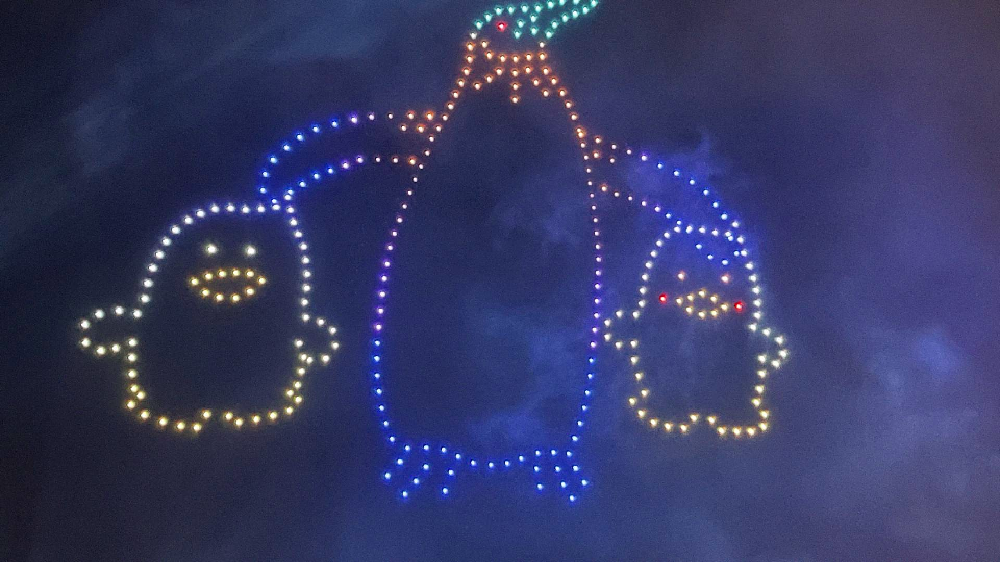
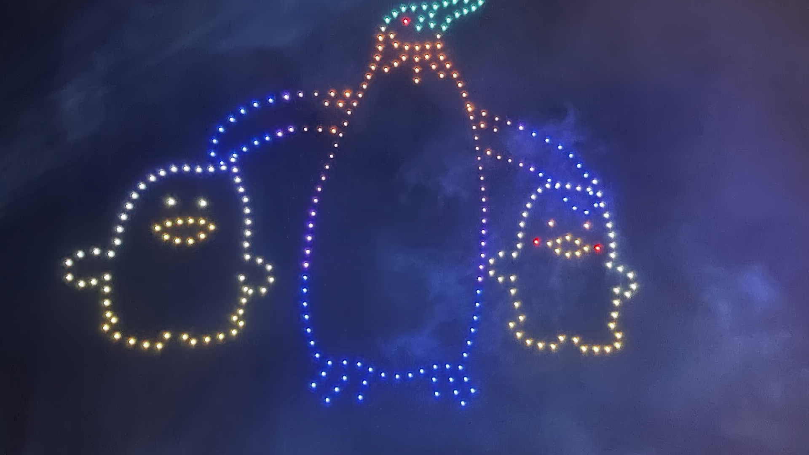
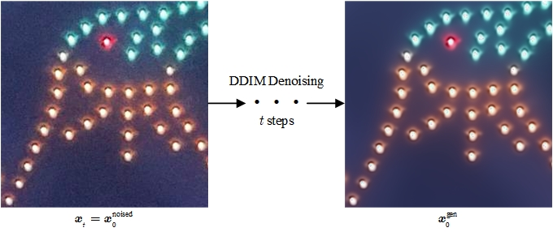

# DiffDenoise
Existing denoising methods require paired clean and noisy images for training, i.e., they are supervised. 
However, in reality, it is difficult to obtain clean images corresponding to noisy ones. 
For additive Gaussian noise, it aligns perfectly with diffusion models, as they are inherently noise predictors.

## Requirements
### Environment
The code requires `python>=3.8`, as well as `pytorch>=1.7` and `torchvision>=0.8`.
Install conda environment by running
```
conda env create -f environment.yaml
conda activate diffdenoise
```

### Download pretrained models and datasets
```shell
bash scripts/download.sh
```

## Image Denoising with DDIM
### Patch Splitting
```text
Split the image into 256*256 patches (If you use 512*512 Diffusion Models, you can split the image into 512*512 patches).
```
```shell
python scripts/preprocess_crop.py
```
### Patch Denosing and Merging
Custom denoising start timestep: Starting from a noisy image, use the diffusion model to predict noise and apply DDIM sampling for the next step.



```text
Input parameter description:
python main.py
    --config_file           Main config file path
    --input:                The path to the input image or folder
    --output:               Output directory
    --gpu                   Select GPU device to run (default: 0)
    --debug                 Save intermediate outputs (disabled by default)）
    --use_denoise           Enable diffusion model for denoising (disabled by default)
    --ddim.denoise_step     Denoising start step (default: step 5)
```

```shell
python main.py --config_file configs/config.yaml --input data_noised/00140 --output results --use_denoise
```

## References
the real world noised images come from ZTE (https://challenge.zte.com.cn).

Our implementation is based on following repos:
*https://github.com/openai/guided-diffusion
